[Back](./README.md)

# Синтаксис регулярных выражений в Java
Синтаксис регулярных выражений основан на использовании символов `<([{\^-=$!|]})?*+.>`, которые можно комбинировать с буквенными символами. В зависимости от роли их можно разделить на несколько групп:

1. Метасимволы для поиска совпадений границ строк или текста.

|Метасимвол|Назначение                  |
|---------:|:---------------------------|
|`^`       |начало строки               |
|`$`       |конец строки                |
|`\b`      |граница слова               |
|`\B`      |не граница слова            |
|`\A`      |начало ввода                |
|`\G`      |конец предыдущего совпадения|
|`\Z`      |конец ввода                 |
|`\z`      |конец ввода                 |

2. Метасимволы для поиска символьных классов.

|Метасимвол|Назначение                                                       |
|---------:|:----------------------------------------------------------------|
|`\d`      |цифровой символ                                                  |
|`\D`      |нецифровой символ                                                |
|`\s`      |символ пробела                                                   |
|`\S`      |непробельный символ                                              |
|`\w`      |буквенно-цифровой символ или знак подчёркивания                  |
|`\W`      |любой символ, кроме буквенного, цифрового или знака подчёркивания|
|`.`       |любой символ                                                     |

3. Метасимволы для поиска символов редактирования текста.

|Метасимвол|Назначение               |
|---------:|:------------------------|
|`\t`      |символ табуляции         |
|`\n`      |символ новой строки      |
|`\r`      |символ возврата каретки  |
|`\f`      |переход на новую страницу|
|`\u0085`  |символ следующей строки  |
|`\u2028`  |символ разделения строк  |
|`\u2029`  |символ разделения абзацев|

4. Метасимволы для группировки символов.

|Метасимвол    | Назначение
|-------------:|:------------------------------------------------------------------|
|`[абв]`       |любой из перечисленных (а,б, или в)                                |
|`[^абв]`      |любой, кроме перечисленных (не а,б, в)                             |
|`[a-zA-Z]`    |слияние диапазонов (латинские символы от a до z без учета регистра)|
|`[a-d[m-p]]`  |объединение символов (от a до d и от m до p)                       |
|`[a-z&&[def]]`|пересечение символов (символы d,e,f)                               |
|`[a-z&&[^bc]]`|вычитание символов (символы a, d-z)                                |

5. Метасимволы для обозначения количества символов – квантификаторы. Квантификатор всегда следует после символа или группы символов.

|Метасимвол| Назначение                    |
|---------:|:------------------------------|
|`?`       |один или отсутствует           |
|`*`       |ноль или более раз             |
|`+`       |один или более раз             |
|`{n}`     |n раз                          |
|`{n,}`    |n раз и более                  |
|`{n,m}`   |не менее n раз и не более m раз|
|`*?`      |символ ? после квантификатора делает его ленивым, чтобы найти наименьшее количество совпадений|

# Жадный режим квантификатора
Особенностью квантификаторов является возможность использования их в разных режимах: жадном, сверхжадном и ленивом. Сверхжадный режим включается добавлением символа `+` после квантификатора, а ленивый – символа `?`. Например:
```
"А.+а"  // жадный режим
"А.++а" // сверхжадный режим
"А.+?а" // ленивый режим
```
Попробуем на примере этого шаблона разобраться в работе квантификаторов в различных режимах. 

По умолчанию квантификатор работает в жадном режиме. Это означает, что он ищет максимально длинное совпадение в строке. В результате выполнения этого кода:
```java
public static void main(String[] args) {
    String text = "Егор Алла Александр";
    Pattern pattern = Pattern.compile("А.+а");
    Matcher matcher = pattern.matcher(text);
    while (matcher.find()) {
        System.out.println(text.substring(matcher.start(), matcher.end()));
    }
}
```
мы получим такой вывод:
```
Алла Алекса
```

Алгоритм поиска по заданному шаблону `А.+а`, выполняется в следующей последовательности:
## Жадный режим квантификатора
1. В заданном шаблоне первый символ – это русский символ буквы `А`. `Matcher` сопоставляет его с каждым символом текста, начиная с нулевой позиции. На нулевой позиции в нашем тексте находиться символ `Е`, поэтому `Matcher` перебирает последовательно символы в тексте, пока не встретит совпадение с шаблоном. В нашем примере это символ на позиции №5.

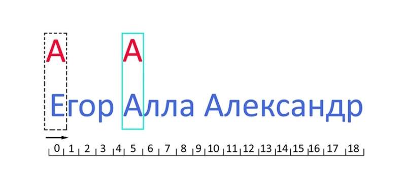

2. После того, как найдено совпадение с первым символом шаблона, `Matcher` сверяет соответствие со вторым символом шаблона. В нашем случае это символ `.`, который обозначает любой символ.

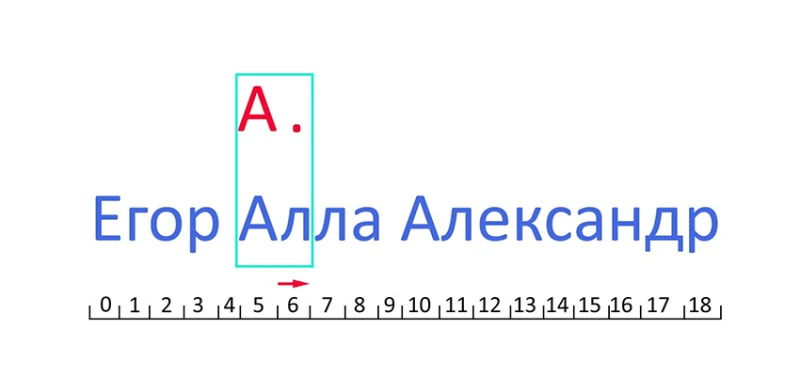

На шестой позиции – символ буквы `л`. Разумеется, он соответствует шаблону «любой символ».

3. `Matcher` переходит к проверке следующего символа из шаблона. В нашем шаблоне он задан с помощью квантификатора `.+`. Поскольку количество повторений «любого символа» в шаблоне – один и более раз, `Matcher` берет по очереди следующий символ из строки и проверяет его на соответствие шаблону, до тех пор, пока будет выполняться условие «любой символ», в нашем примере – до конца строки (с поз. №7 по поз. №18 текста).

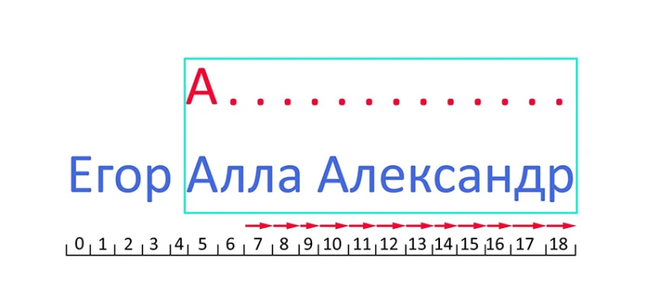

По сути, `Matcher`, захватывает все строку до конца – в этом как раз и проявляется его «жадность».

4. После того как `Matcher` дошел до конца текста и закончил проверку для части шаблона `А.+`, `Matcher` начинает проверку для оставшейся части шаблона – символ буквы `а`. Так как текст в прямом направлении закончился, проверка происходит в обратном направлении, начиная с последнего символа:

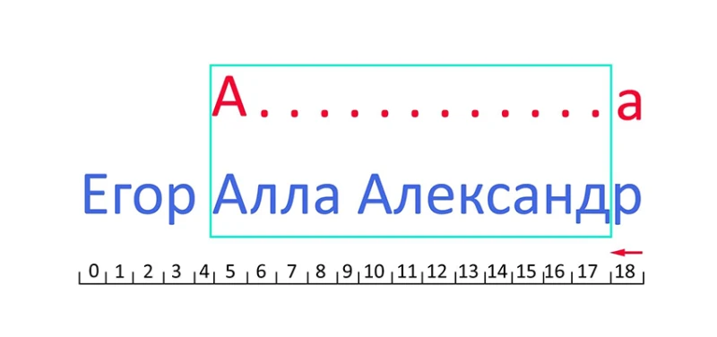

5. `Matcher` «помнит» количество повторений в шаблоне `.+` при котором он дошел до конца текста, поэтому он уменьшает количество повторений на единицу и проверяет соответствие шаблона тексту, до тех пор пока не будет найдено совпадение:

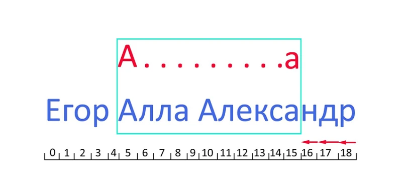

## Сверхжадный режим квантификатора
В сверхжадном режиме работа матчера аналогична механизму жадного режима. Отличие состоит в том, что при захватывании текста до конца строки поиск в обратном направлении не происходит. То есть первые три этапа при сверхжадном режиме будут аналогичны жадному режиму. После захвата всей строки матчер добавляет остаток шаблона и сравнивает с захваченной строкой. В нашем примере при выполнении метода `main` с шаблоном `А.++а` совпадений не будет найдено.

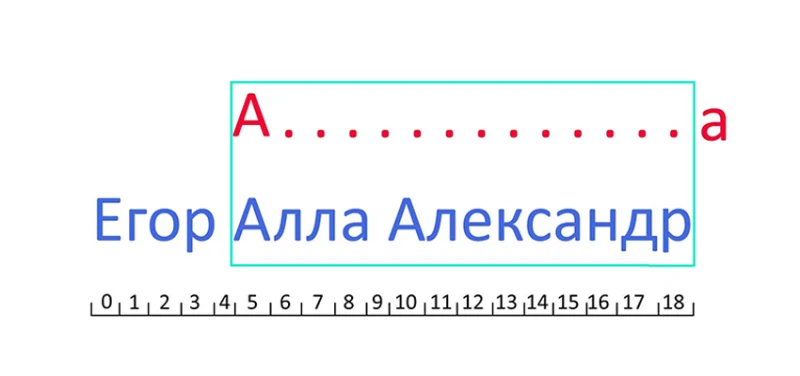

## Ленивый режим квантификатора
В этом режиме на начальном этапе, как и в жадном режиме, ищется совпадение с первым символом шаблона:

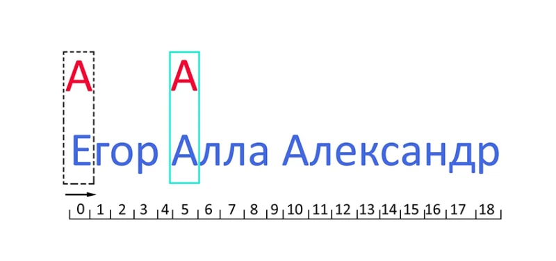

Далее ищется совпадение со следующим символом шаблона – любым символом:

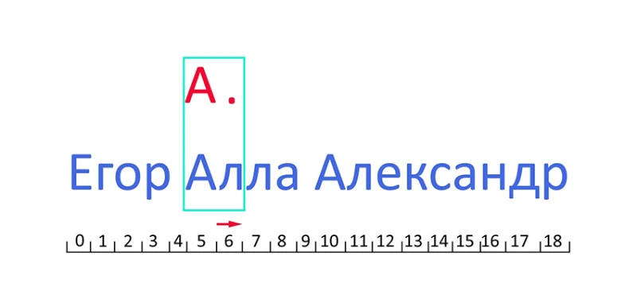

В отличие от жадного режима, в ленивом ищется самое короткое совпадение в тексте, поэтому после нахождения совпадения со вторым символом шаблона, который задан точкой и соответствует символу на позиции №6 текста, `Matcher` будет проверять соответствие текста остатку шаблона – символу `а`

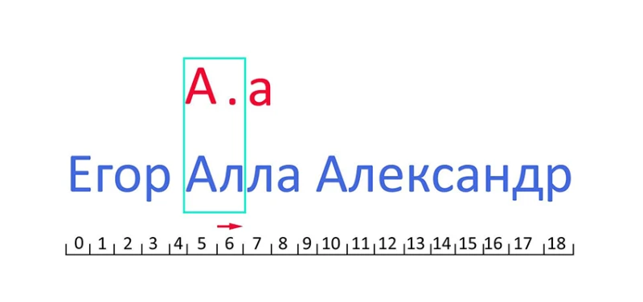

Поскольку совпадение с шаблоном в тексте не найдено (на позиции №7 в тексте находится символ `л`), `Matcher` добавляет еще один «любой символ» в шаблоне, так как он задан как один и более раз, и опять сравнивает шаблон с текстом на позициях с №5 по №8:

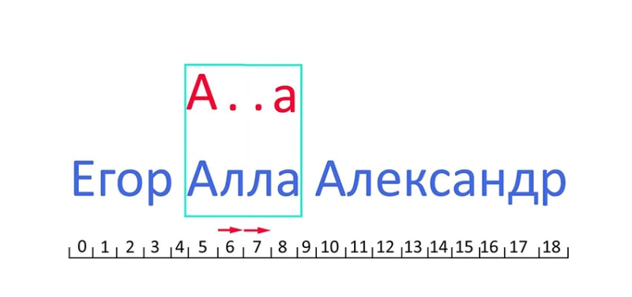

В нашем случае найдено совпадение, но конец текста ещё не достигнут. Поэтому с позиции №9 проверка начинается с поиска первого символа шаблона по аналогичному алгоритму и далее повторяется вплоть до окончания текста.

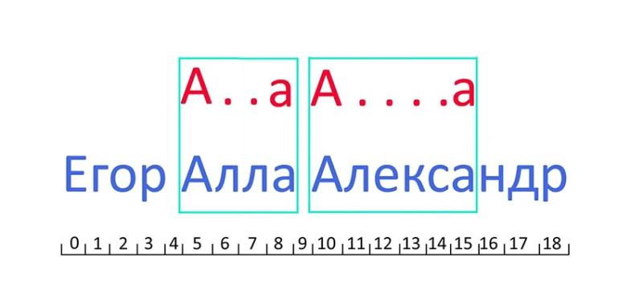

В результате работы метода `main` при использовании шаблона `А.+?а` мы получим следующий результат:
```
Алла
Алекса
```
Как видно из нашего примера, при использовании разных режимов квантификатора для одного и того же шаблона мы получили разные результаты. Поэтому необходимо учитывать эту особенность и выбирать нужный режим в зависимости от желаемого результата при поиске.
> Текст взят из [Регулярные выражения в Java (RegEx) автор Владимир Портянко Java-разработчик в Playtika](https://javarush.com/groups/posts/regulyarnye-vyrazheniya-v-java).

[Back](./README.md)
